<div align="center">

# Primer

Learn machine learning, LLMs, and data insights by building small local projects, then scale to the pro stack

[![Live][badge-site]][url-site]
[![HTML5][badge-html]][url-html]
[![CSS3][badge-css]][url-css]
[![JavaScript][badge-js]][url-js]
[![Claude Code][badge-claude]][url-claude]
[![License][badge-license]](LICENSE)

[badge-site]:    https://img.shields.io/badge/live_site-0063e5?style=for-the-badge&logo=googlechrome&logoColor=white
[badge-html]:    https://img.shields.io/badge/HTML5-E34F26?style=for-the-badge&logo=html5&logoColor=white
[badge-css]:     https://img.shields.io/badge/CSS3-1572B6?style=for-the-badge&logo=css3&logoColor=white
[badge-js]:      https://img.shields.io/badge/JavaScript-F7DF1E?style=for-the-badge&logo=javascript&logoColor=black
[badge-claude]:  https://img.shields.io/badge/Claude_Code-CC785C?style=for-the-badge&logo=anthropic&logoColor=white
[badge-license]: https://img.shields.io/badge/license-MIT-404040?style=for-the-badge

[url-site]:   https://primer.neorgon.com/
[url-html]:   #
[url-css]:    #
[url-js]:     #
[url-claude]: https://claude.ai/code

</div>

---

## Overview

Primer is a hands-on ramp for people who are not data-oriented yet. It turns machine learning, LLMs, and data analysis into a series of small pet projects you can run on your own laptop, with copy-paste code that escalates in difficulty. Build the small version first, then map each one to the professional tool that Fortune 500 teams run at scale.

Every code block was executed locally before being published. The outputs you see on the site are the real outputs.

**Live:** primer.neorgon.com

---

## Tracks

Seven tracks across five levels, from plain-language mental models to the enterprise stack.

- **Foundations** (L0) -- the mental models of ML, models, LLMs, and insights, in plain words
- **Data Insights** (L1) -- turn a CSV into findings with pandas
- **Classic ML** (L2) -- train your first classifier with scikit-learn
- **Local LLMs** (L2) -- run an open model on your own machine with Ollama
- **RAG & Embeddings** (L3) -- chat with your own documents
- **Model Training** (L3) -- train an image classifier from scratch with PyTorch
- **Professional Stack** (L4) -- map every pet project to what the 500s actually run

---

## Features

- **Escalating difficulty** -- each level builds on the last, from zero code to training a neural network
- **Tested, paste-ready code** -- code blocks and their real outputs, verified locally
- **One-click copy** -- copy any snippet with a single button
- **Progress tracking** -- mark steps done; progress persists in the browser
- **Runs locally and free** -- no cloud, no API keys, no signup

---

## Running locally

ES modules require an HTTP server (not `file://`):

```bash
python3 -m http.server 8853
```

Then open http://localhost:8853.

---

## Architecture



```
primer-site/
├── index.html          # App shell + #view container
├── css/
│   └── style.css       # Design tokens + hub/track styles
├── js/
│   ├── app.js          # Entry point (wires modules)
│   ├── state.js        # Route parsing + progress + localStorage
│   ├── events.js       # Hash routing, copy, mark-done
│   ├── render.js       # Hub (level bands) + track pages
│   ├── content.js      # All learning content: 7 tracks, tested code
│   └── utils.js        # escHtml, toast, debounce
└── docs/
    └── architecture.mmd/.svg   # This diagram
```

---

<div align="center">
<sub>Part of <a href="https://neorgon.com/">Neorgon</a></sub>
</div>
